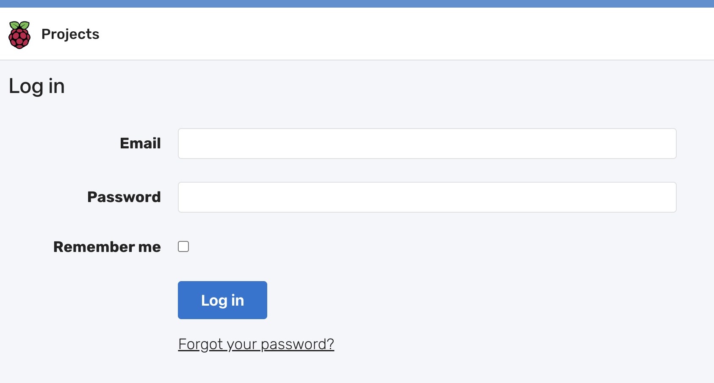
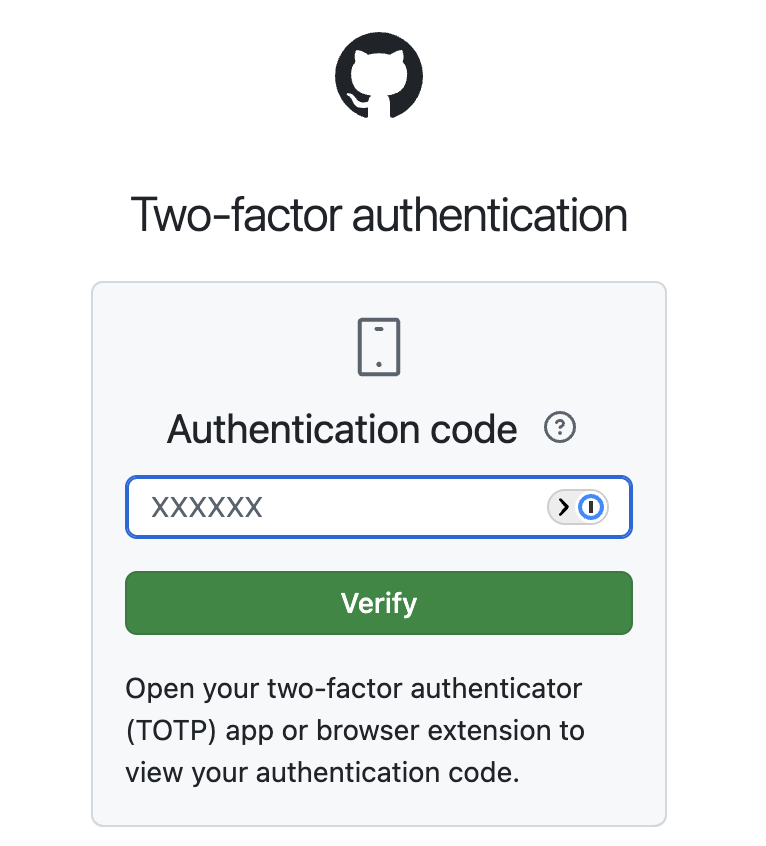
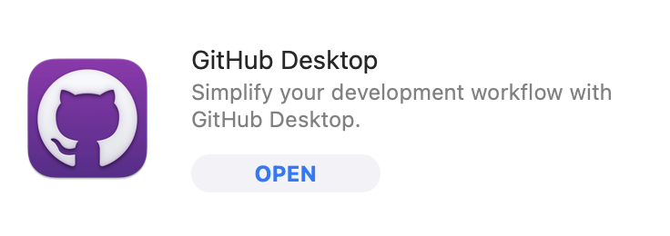
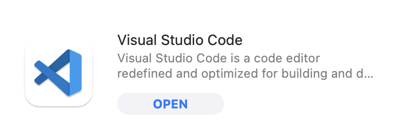

## Getting started

### You will need access to the following:
- [Raspberry Pi Foundation Learning Admin](https://learning-admin.raspberrypi.org/admin/projects)
- [GitHub](https://github.com/) 
- GitHub desktop application (download via Kandji)
- Visual Studio (VS) Code desktop application (download via Kandji)

## Setting up your Learning Admin account
Learning admin is the database where the project is created. This database turns everything you write into HTML and that’s what the Projects Site downloads, it’s not taken from GitHub.
- Set up your Learning Admin account using your Raspberry Pi credentials and save your login information in 1Password
- Be careful to rename your saved login details as ‘Learning Admin’ or something similar to avoid overwriting your other RPF logins

## Setting up your GitHub account
- Sign up for GitHub and log in
- You will be asked for two factor authentication, retrieve your code on the Google Authenticator app (you can download this to your phone and login with your Raspberry Pi credentials)
- Once you are logged in to GitHub make sure you save a copy of your recovery codes

- GitHub groups to be added to by your Senior Learning Manager
    - raspberrypilearning organization
    - raspberrypilearning/foundation-staff
    - raspberrypilearning/learning-team
    - raspberrypilearning/content-team
- Download the GitHub desktop app via Kandji

## Accessing Visual Studio (VS) Code
- Download the VS Code desktop app via Kandji
- No login details are required just open and start using

