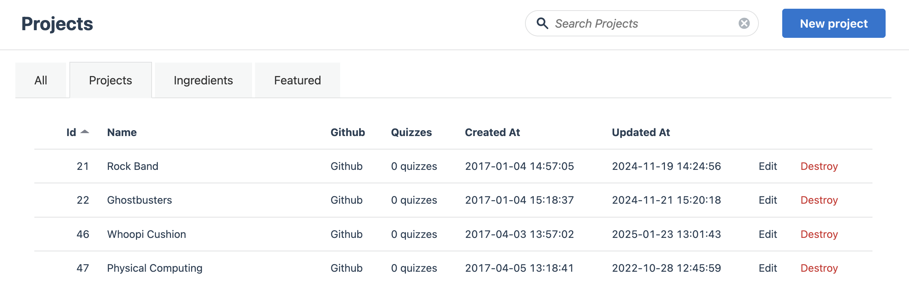
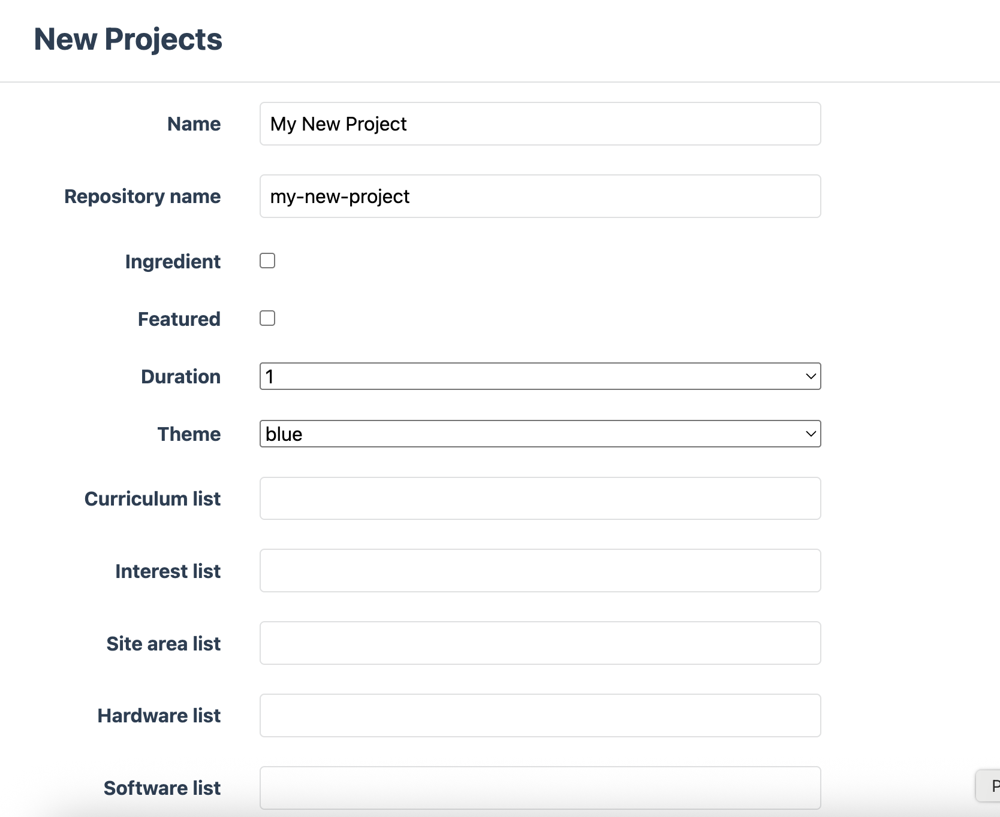
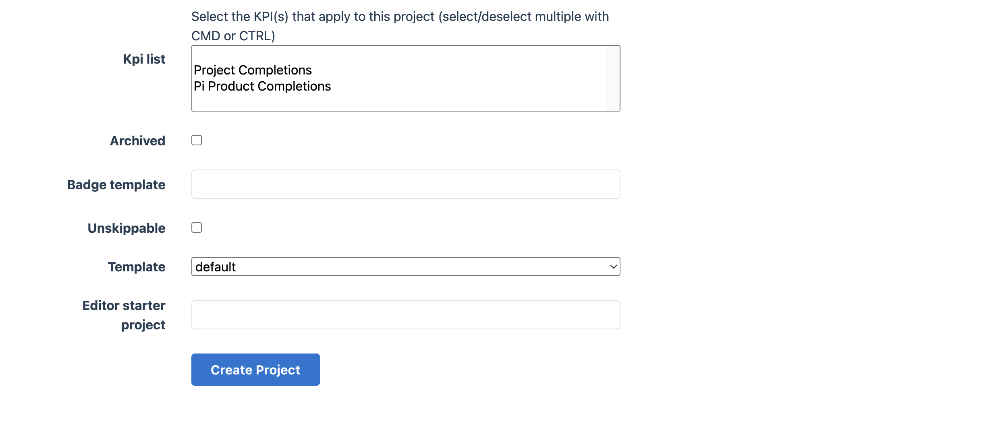

## Creating a new project

New projects are created in Raspberry Pi Learning Admin. 

1. Log in to [learning admin](https://learning-admin.raspberrypi.org/admin/projects) and go to the Projects tab.

1. Select ‘New Project’

1. Complete the following fields:

- **Name:** Give your project a name, there are no rules regarding spacing, case etc in this field e.g. My New Project

- **Repository Name:** This must be in lower case and contain no spaces e.g. my-new-project

- **Ingredient:** These are little projects that sit within a main project, only tick this box if you will be using ingredients from other projects

- **Featured:** Not currently used, leave blank

- **Duration:** How long the project is, this is not really used leave as 1

- **Theme:** Not really used leave as it is

- **List Fields:** These affect the dropdown options that are available in the ‘Find a Project’ bar on the Projects site
        - Curriculum list
        - Interest list
        - Site Area list (not in use) 
        - Hardware list add in lower case
        - Software list add in lower case

- **KPI list:** Select the KPI(s) that apply to this project (select/deselect multiple options with CMD or CTRL). This is used in the Looker Studio data analysis (the Pi option is used to separate out the Raspberry Pi projects as they are so popular) in this instance for KPI select **Project Completions**

- **Archived:** If project no longer useful this removes it from all projects area but links to it will still exist for newsletter etc. A banner will appear to say don’t expect updates etc and it becomes non searchable on database

- **Badge template:** Looks up graphics for badge

- **Unskippable:** Was created purely for the safe-guarding module, no need to tick

- **Template:** Default

- **Editor starter project:** If created in Code Editor type name in here e.g. my-new-project

