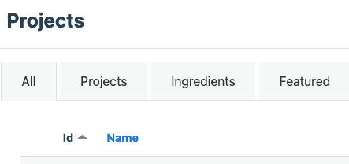

## Troubleshooting errors

### Errors when creating your project

When you press **‘Create Project’** you may find that this doesn’t work and you get an error message.

This is an issue with the database and not something that you’ve done wrong. However, you now need to *delete this in the learning admin database and in GitHub* before starting the create a project process again.

### How to delete your project from the database  
- Go back to learning admin and click on ID to sort the list and get the newest created projects at the top

- Locate your project and press the red **‘Destroy’** button
- The ‘Destroy’ button always asks for confirmation
- Doing this only destroys the project in the database it doesn’t affect GitHub

### How to delete your project from GitHub
- In your main GitHub account go to 'Settings'

- Choose 'Delete Repository'

