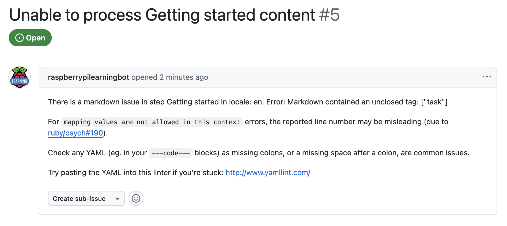
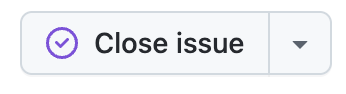

## Project notifications

Every time you build a project or make updates you will be notified in the **#project-notifications** slack channel. 

Some projects can take time to build, especially if there are a number of translations of the project. The more translations the longer it takes, so if your notification takes some time to appear this is likley the reason why.

Below are some examples of messages you may receive, what they mean and actions to take.

--- task ---

### Project created successfully

- Once your project has successfully been created a notification will appear in the **#project-notifications** slack channel
- Open the link in that channel to see the draft project template
- Your project is now set up and you can begin to write it in VS Code!

--- /task ---

--- task ---

### Project failed to build

- If there is an error within the project it will fail to build and you will be notified in the **#project-notifications** slack channel

- On the notification click the **check the issues** link
- This will open the issue in GitHub where you can find more detail and see what needs to be fixed
- Once you have fixed the problem, close the issue in GitHub to clear it

--- /task ---

--- task ---

### Rate limits exceeded

- There are **rate limits** for GitHub and Amazon that can occasionally stop the build process
- You will be notified at what time the rate limit is refreshed

--- /task ---