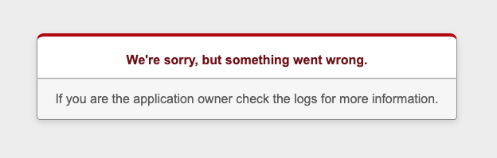
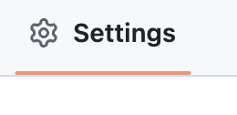
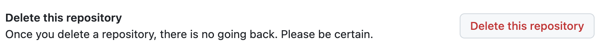
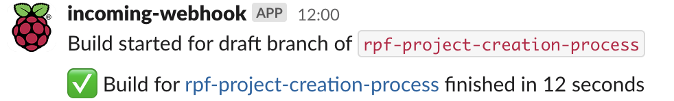

### Errors when creating your project

When you press ‘Create Project’ you may find that this doesn’t work and you get an error message.

This is an issue with the database and not something that you’ve done wrong. However, you now need to **delete this in the learning admin database and in GitHub** before starting the create a project process again.

### How to delete your project from the database  
- Go back to learning admin and sort by ID
- Locate your project and press ‘Destroy’
- The ‘Destroy’ button always asks for confirmation
- Doing this only destroys the project in the database it doesn’t affect GitHub

### How to delete your project from GitHub
- In your main GitHub account go to 'Settings' and choose 'Delete Repository'

### What happens next?
- Once you have deleted the project from the learning admin database and GitHub, you need to begin the create a project process again
- Continue this until the project creates successfully and you don't receive an error message
- It may take a few times for this to work, remember to delete the failed project each time before starting again
- Once your project has successfully been created a notification will appear in the **#project-notifications** slack channel
- Open the link in that channel to see the draft project template
- Your project is now set up and you can begin to write it in VS Code!

