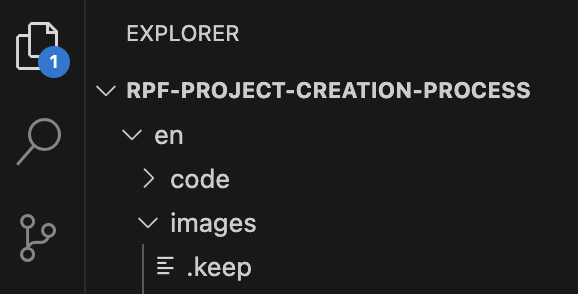

## Markdown tips

**Markdown** is a programming language that doesn’t require knowledge of HTML and makes it easier to format your text. Here are a few tips to get you started and to understand the Code Club Projects use and style of markdown.

## Markdown and syntax style guide

--- task ---

### Headings

One hash `# Title` will create a level 1 header
# Title

Two will create `## Title` will create a level 2 header		
## Title

Three will create `### Title` will create a level 3 header			

### Title

We only use level 2 or 3 headings for projects at the Raspberry Pi Foundation.

- `## You will make` — Always appears at the top of step_1.md, describing the project goal in plain language.


- `## Introduction`, `## What you will learn`, etc. — Use ## for main your sections.


- `### and ####` — Use for subsections, such as activity titles or side explanations.

--- /task ---


--- task ---

### Text Emphasis

- Use ** to bold your text for example `**Hello**`
- Use * or _ for italics 

**Bold** is used:
- For **menu items**, **button labels**, and **user interface terms** (e.g., **Code**, **Costumes**, **Click**, **Choose a Sprite**).
- To draw attention to critical instructions or important outcomes.


*Italics* are used:
- Sparingly, for *emphasis*, terms being defined, or gentle guidance.

--- /task ---


--- task ---

### Lists
- Use hyphen (-) to create bullet points
- Use bullet points for goals, steps, or lists of items
- Use 1. for numbers, you can put 1. everytime and it will number in order anyway 1. 2. 3. as it doesn't recognise numbers!
- However, numbered lists (1., 2., etc.) are avoided unless order is crucial

--- /task ---


--- task ---

### Code Formatting
- Inline code is wrapped in backticks, like `move 10 steps`
- Scratch block references are written like this:

`Looks`{:class="block3looks"}
`Sound`{:class="block3sound"}

- These class attributes style the block to colour in the same style as they are in Scratch

- Longer code examples use triple backticks:

```
print('Hello World!')
```

--- /task ---


--- task ---

### Special Tags

- These custom tags affect how the markdown renders in the learning platform
- Used to define **interactive activities or embedded Scratch projects**

`--- task ---`

- To wrap content that should not appear in the print version (like interactive components or iframes) use:

`--- no-print ---`

- To insert alternate content (like screenshots or static text) for printed versions of the project use:

`--- print-only ---`

- To mark something as optional or stretch challenge use: 

`--- challenge ---`


--- /task ---


--- task ---

### Media
- Add your image or screeshot to the en-image file in Finder or drag and drop it into the images folder on the left hand side of VS Code





- Give images simple names with no spaces, always use a hyphen or an underscore
- Add images using ``
- Use alt text for all images for accessibility
- In the square brackets enter the alt text 
- In the round brackets enter **images/** then select the image you have added from the dropdown options
- To change the main banner image name your chosen image **banner.png** and drag and drop it into the images folder, this will change the banner image to the one that you’ve added
- Videos or Scratch embeds are added in `--- task ---` sections using iframes

--- /task ---


## Pedagogical Structure

--- task ---

Each step typically includes:

1. Goal introduction
- `## You will make:` One sentence overview in step_1.md

1. Demonstration
- Visual or interactive example in a `--- task ---` block

1. Instructions
- Clear, sequential instructions
- Refer to Scratch interface terms in bold
- Highlight Scratch blocks using inline styling

1. Mini challenges
- Ask exploratory questions:

 What do you think will happen if...?
 Can you make the sprite say something different?

- Optional: add `--- challenge ---` blocks

1. Summary
- Wrap up with a review of what was done or learned


--- /task ---


## Other useful tips


--- task ---

### Tables
- Use colons to align columns
- Use at least 3 dashes to separate each header cell
- Use the pipe key to create the outer lines of the table

Example below:


| Header 1 | Header 2 | Header 3 |

`| : - - - | : - - - | : - - - |`

| hello | hi | bye |

--- /task ---


--- task ---

### Adding links
- Add the name that you want to show into square brackets
- Add the website (http url) you want to link to in the round brackets
- You can link to steps internally within your project by adding the step name into the round brackets. However, internal links won't actually work until project has been pushed to master

`[GitHub](https://github.com/)`

`[Step 4](step_4.md)`

--- /task ---


--- task ---

### To create a new step
- In VS Code go to File > New File add ‘step_4.md’ for example and press enter
- This creates a new folder in the en directory


--- /task ---
