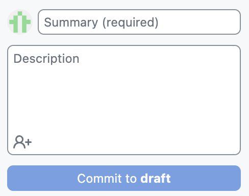
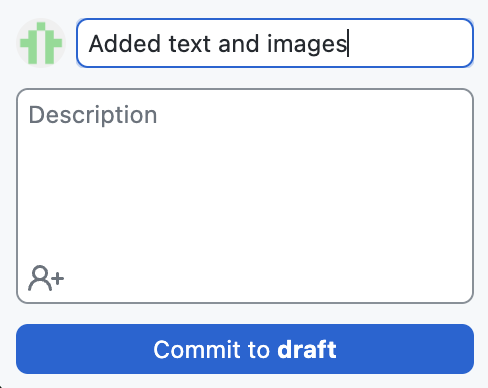
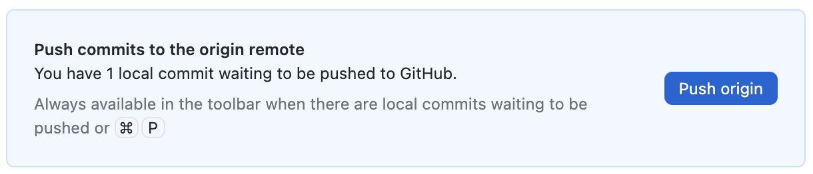
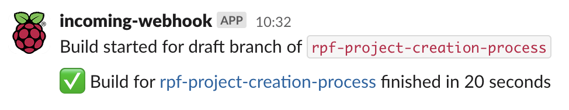
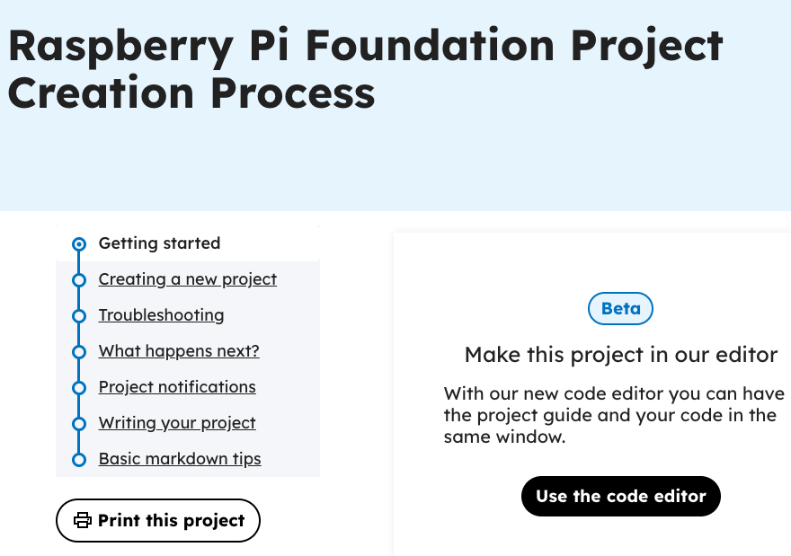

## Writing your project

Once your project has been successfully created in the learning admin database you can begin to create the project using VS Code.

## Open GitHub Desktop

- In the top left hand corner go to **Current Repository** and click on the drop down arrow 

- Go to **Add** and using the drop down arrow select **Clone Repository**

- In the **Filter your repositories** box search by the name of your project

- Once found click **Clone**

## Open in Finder

- Open **Finder** on your Mac [Finder_Icon](images/Finder_Icon.png)
- In **Documents** you should see a GitHub folder
- A new subfolder should have been created in the name of your project in the GitHub folder

- Click inside this and you will see the folder directory for your project

## Go Back to GitHub Desktop
- Locate the **Current Branch** drop down arrow in the menu at the top and switch to **draft branch**
- Always work on the draft branch at first not the master
- Switching to the draft branch changes the folder in Finder

## Open VS Code
- Open **en folder** on left hand side
- Here you will see step_1.md, step_2.md, step_3.md 

- Go to the meta.yml tab (steps have to be in meta yml)
- Change the title to the title of your project, this doesn't have to be in lower case and should be how you want it to be displayed
- Use **Command S** to save your edits 

- Go back to GitHub desktop to see the change
- You may be asked for a summary of the changes you have made, complete this then you will be able to press **Commit to draft**

- Next press **Push origin**

- Go to slack to **#project-notifications** wait for the notification to come through and the build to finish

- Open the link to see your project begin to take shape!

- You can now continue to build your project this way using **Markdown**
- See the next page for some basic tips and advice to get you started