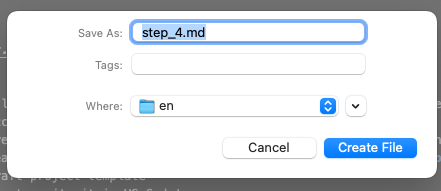

## Markdown tips

**Markdown** is a programming language that doesn’t require knowledge of HTML.

### Saving
- Always remember to save using **Command S**
- A circle over one of the tabs in VS Code means you haven’t saved it yet
- Make sure you use **Command S** in each of the tabs that you see a circle otherwise your changes won't be pushed to your draft

### Headers

One hash `# title` will create a level 1 header
# title

- Two will create 			
	## Heading 2
- Three will create 		
	### Heading 3

- We only use level 2 or 3 headings for projects at the Raspberry Pi Foundation

### Bullets
- Use hyphen - for bullets 
- Use 1. for numbers, you can always put 1. and it will number in order anyway 1. 2. 3. as it doesn't recognise numbers!

### Images
- Add to en-image file in Finder or drag and drop to images folder on the left hand side of VS Code
- Give images simple names with no spaces, always use a hyphen or an underscore
- In the square brackets enter the alt text 
- In the round brackets enter **images/** then select the image you have added from the dropdown options
- To change the main banner image name your chosen image **banner.png** and drag and drop it into the images folder, this will change the banner image to the one that you’ve added

### Links 
- In the square brackets enter the text you want to show
- In the round brackets enter the http url

### Tables
- Use colons to align columns
- Use at least 3 dashes to separate each header cell
- | = pipe key, use this key to create outer lines of the table

Example below:

| Header 1 | Header 2 | Header 3 |

| : - - - | : - - - | : - - - |

| hello | hi | bye |

### Internal links
- Add the name you want to show into square brackets
- Add the step you want to link to in the round brackets
- Internal links won't actually work until project has been pushed to master

### To create new step
- In VS Code go to File > New File add ‘step_4.md’ for example and press enter
- Creates new folder in the en directory

